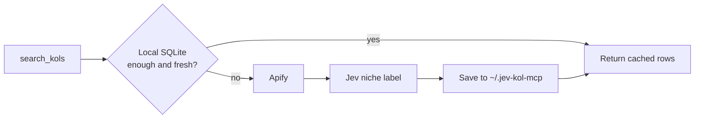

# jev-kol-mcp

English · [中文](https://github.com/EdgeForgeLab/jev-kol-mcp/blob/main/README.zh-CN.md)

**Find TikTok and YouTube micro-KOLs, label their niche, and score whether they fit a campaign.**

MCP server powered by [Jev](https://typesafe.ai/blog/introducing-system-one-models-and-jev), TypeSafe's System One model. Search and storage stay in this server. Jev answers typed questions. The host model writes the email.

[](https://nodejs.org)
[](LICENSE)
[](https://modelcontextprotocol.io)

Jev does not write the search results or the emails. It answers typed questions: one choice for the creator's niche, then a score, probabilities, and choices for whether that creator fits a campaign. Search and storage stay in this server. The host model writes the email. An optional skill in `skills/draft-outreach` tightens that draft.

## Quick Install

Paste this into Cursor, Claude Desktop, or Cline. The agent can install from this text alone:

```text
Install jev-kol-mcp for me.
1. Check that Node.js is 18 or newer and that npx is on PATH. Stop if either is missing. Run `command -v npx` and use that absolute path as command. Do not write the bare word npx. Cursor's own Node looks for a missing path inside Cursor.app and the server exits immediately.
2. Ask me for APIFY_API_TOKEN and JEV_API_KEY. If I do not have one yet, still write the config and leave that value as an empty string. Tell me which tool will not work. Do not invent a key, and do not print a key back to me.
3. Detect the client and merge this server into the existing mcpServers object. Do not remove other servers. Create the file if it is missing.
   Cursor, this project: .cursor/mcp.json
   Cursor, every project: ~/.cursor/mcp.json
   Claude Desktop on macOS: ~/Library/Application Support/Claude/claude_desktop_config.json
   Claude Desktop on Windows: %APPDATA%\Claude\claude_desktop_config.json
   Cline: the mcpSettings file I point you to
4. Use this entry. Every env value is a string.
   command: the absolute path from `command -v npx`
   args: ["-y", "jev-kol-mcp@latest"]
   env: APIFY_API_TOKEN, JEV_API_KEY, FETCH_LIMIT "12"
   server key: jev-kol
5. Do not commit the config file. Do not run search_kols. Tell me the file you updated, whether each key was set, and that I should reload MCP. After reload the tools are search_kols, score_fit, and draft_email.
```

The process speaks MCP over stdio. It is not an HTTP server, and it does not print a prompt. Logs go to stderr. Leave stdout for the MCP protocol.

## Example

Ask for creators in a follower range. The agent searches, labels each niche, and scores the campaign.


## What you can ask

| Tool | What it does | Needs |
| --- | --- | --- |
| `search_kols` | Find creators by platform, keyword, and follower range | `APIFY_API_TOKEN` |
| `score_fit` | Score one creator against one campaign, 0–100 | `JEV_API_KEY` |
| `draft_email` | First outreach email, plus a follow-up for day 3 | `JEV_API_KEY` |

`draft_email` checks that the Jev key is present, then fills a local English template. The body is not written by Jev. For a draft in the user's own words, copy `skills/draft-outreach` to `~/.cursor/skills/draft-outreach`. The server instructions mention that path once when a user asks for an email. The server does not send mail. The follow-up is a second draft for the same thread, used only after the first email was sent and 3 days passed with no reply. One follow-up, same offer, then stop.

## How a search runs



The same platform, keyword, and follower range is reused for 7 days. Cached rows are not scraped again and are not re-labeled. There is no ignore-cache flag. Delete `~/.jev-kol-mcp/kols.sqlite` to search again; the next search creates an empty database. A failed Jev call does not fail the search: the profile is stored with an empty niche.

Without `JEV_API_KEY`, `search_kols` still returns creators and `primaryNiche` stays empty. It is not filled with `Other`. `score_fit` and `draft_email` return setup guidance instead.

Follower bounds are sent to the scraper. This server still drops anything outside the range before it returns rows.

| Platform | Apify actor | What the range filters |
| --- | --- | --- |
| TikTok | [`memo23/tiktok-user-search-scraper`](https://apify.com/memo23/tiktok-user-search-scraper) | followers |
| YouTube | [`parsebird/youtube-channel-search-scraper`](https://apify.com/parsebird/youtube-channel-search-scraper) | public subscribers |

`FETCH_LIMIT` is how many matching profiles to request. Default **12**. All of them are stored. `limit` on the tool is how many to return: default **5**, maximum **20**.

YouTube's `countryHint` is left at the actor default. It biases ranking. It does not keep only channels from that country.

## What comes back

Each stored creator has these fields. Avatars are not stored.

| Field | Meaning |
| --- | --- |
| `handle` | Account handle, with `@` |
| `displayName` | Name shown on the profile |
| `followers` | TikTok followers, or YouTube subscribers |
| `bio` | Public profile text |
| `contactEmail` | Email read from the public bio with a regex. `null` when none is published |
| `emailType` | `personal` or `agency` when an email was found, otherwise `null` |
| `profileUrl` | Profile page |
| `verified` | Whether the actor marked the account verified. `null` when it did not say |
| `videoCount` | Number of public videos |
| `totalLikes` | TikTok likes. Always `null` on YouTube |
| `totalViews` | YouTube views. Always `null` on TikTok |
| `location` | TikTok region code when the actor reports one, or the YouTube channel country. Often empty on TikTok |
| `bioLinks` | Links in the bio. Empty for the current TikTok actor. YouTube entries are URLs without anchor text |
| `primaryNiche` | One label from the table below. Empty when Jev was not called or the call failed |

### Niche label

Jev picks one primary niche from the display name and bio. The label is not an input to `score_fit`. Campaign fit is a separate Jev call.

| Label | What it covers |
| --- | --- |
| `Beauty_Skincare` | Skincare, makeup, aesthetics, wigs |
| `Men_Grooming` | Men's grooming, beard care, fragrance, styling |
| `Fashion_Apparel` | Everyday clothing, shoes, bags, outfits, accessories |
| `Luxury_Jewelry` | Accessible luxury, jewelry, watches |
| `Tech_Gadgets` | Consumer electronics, smart home, drones, desk setups |
| `Software_SaaS_AI` | AI tools, productivity software, apps, Web3 or crypto products |
| `Gaming_Esports` | Console or mobile game reviews, streams, esports gear |
| `Fitness_Wellness` | Gym workouts, yoga, supplements, fat loss |
| `Outdoor_Adventure` | Camping, hiking, fishing, skiing, extreme sports |
| `Home_Living` | Home decor, kitchen, appliances, lifestyle vlogs |
| `Food_Cooking` | Food, restaurant visits, baking, quick recipes, drinks |
| `Parenting_Kids` | Parenting, baby products, children's toys |
| `Pet_Care` | Cat and dog products, pet content, exotic pets |
| `Automotive_Vehicles` | Cars, EVs, motorcycles, cycling |
| `Finance_Investing` | Personal finance, stocks, crypto investing, property |
| `Education_Career` | Language learning, careers, study abroad, exams |
| `Arts_DIY_Crafts` | Crafts, painting, 3D printing, design |
| `Entertainment_Humor` | Comedy, street interviews, film and anime, music and dance |
| `Other` | The bio is too thin, or no single niche is clearly primary |

## Campaign fit

`score_fit` sends the handle, bio, and campaign description to `https://api.typesafe.ai/v1/systemone`. It does not see follower counts, location, or the niche label. The model defaults to `jev-latest` (`JEV_MODEL`).

| Field | Meaning |
| --- | --- |
| `score` | 0–100, from Jev's 0–3 fit score |
| `dimensions.fit` | 0 unrelated · 1 weak · 2 partial · 3 strong |
| `dimensions.niche` | Probability that the bio and the product are the same category |
| `dimensions.tone` | `review` · `lifestyle` · `tutorial` · `sincere` · `unknown` |
| `dimensions.priceBand` | Inferred price band, not the creator's rate |
| `suitablePriceRange` | That band in USD, or `null` |
| `dimensions.outreach` | Probability that a first email is worth sending now |
| `dimensions.mismatch` | `none` · `niche` · `tone` · `price` · `evidence` |

Tone is judged from the bio only. Price bands are `food` 15–80, `everyday` 20–100, `beauty` 25–120, `fitness` 30–150, `home` 30–200, `tech` 80–400, `luxury` 200–800. `unknown` means the bio is not enough.

A strong fit requires niche, tone, and price to agree. One clear miss cannot score as a strong fit.

## Use

Node.js 18 or newer. Add the server to the MCP client. Cursor reads `.cursor/mcp.json` in the project, or `~/.cursor/mcp.json` for every project. `npx` downloads the package the first time it starts. You do not clone this repo. `command` must be the absolute path from `command -v npx`, not the bare word `npx`.

```json
{
  "mcpServers": {
    "jev-kol": {
      "command": "/absolute/path/from/command -v npx",
      "args": ["-y", "jev-kol-mcp@latest"],
      "env": {
        "APIFY_API_TOKEN": "your_apify_api_token",
        "JEV_API_KEY": "your_jev_api_key",
        "FETCH_LIMIT": "12"
      }
    }
  }
}
```

`env` values are strings, including `FETCH_LIMIT`. Reload the MCP server after saving the file. The name `jev-kol` is only the key in this snippet. Cursor shows whatever key you choose.

## Install from source

Use this when you are changing the server. The `npx` config above is enough for normal use.

```bash
npm install
cp .env.example .env
npm run build
```

`npm run watch` recompiles into `dist/` on save. `npm start` runs the local build. Point the client at that file instead of `npx`:

```json
{
  "mcpServers": {
    "jev-kol": {
      "command": "node",
      "args": ["/absolute/path/to/jev-kol-mcp/dist/index.js"],
      "env": {
        "APIFY_API_TOKEN": "your_apify_api_token",
        "JEV_API_KEY": "your_jev_api_key",
        "FETCH_LIMIT": "12"
      }
    }
  }
}
```

Missing keys return setup instructions. The process stays up. Placeholder values such as `your_apify_api_token_here` count as missing.

| Variable | Required | Default |
| --- | --- | --- |
| `APIFY_API_TOKEN` | for search | — |
| `JEV_API_KEY` | for niche labels, fit scores, and email drafts | — |
| `JEV_MODEL` | no | `jev-latest` |
| `FETCH_LIMIT` | no | `12` |

- Apify token: <https://console.apify.com/account/integrations>
- Jev key: from TypeSafe, sent as `Authorization: Bearer`

Client-injected environment variables win over `.env`.

The SQLite file lives at `~/.jev-kol-mcp/kols.sqlite`. Deleting it creates an empty database on the next search. Clearing an npx cache does not delete it.

Put real keys in `env`. Do not commit them. To have an agent write the config from a prompt, use `skills/jev-kol-mcp-installer`.

## Example prompts

`search_kols` takes a platform, a keyword, and a follower range. It does not take a country or a niche label. `score_fit` needs the creator's bio and the campaign description. The email offer has to come from you.

```text
Use jev-kol search_kols on TikTok for skincare creators with 10,000 to 200,000 followers. Return 5. List handle, followers, location, primary niche, and bio. Do not score them.
```

```text
Use score_fit for @maya.glow. Bio: clean makeup and affordable daily skincare. Campaign: a budget skincare product about real daily use. Do not draft an email.
```

```text
Search YouTube for coffee espresso channels with 5,000 to 200,000 subscribers. Return 3 with handle, subscribers, and bio. Score each bio against a campaign for a manual espresso machine. Draft an outreach email only for the strongest fit. Ask me for the offer before you write it.
```

## License

[MIT](LICENSE)
