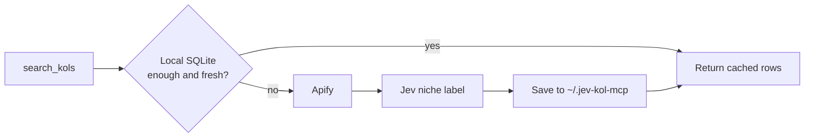

# jev-kol-mcp

English · [中文](README.zh-CN.md)

MCP server powered by [Jev](https://typesafe.ai/blog/introducing-system-one-models-and-jev), TypeSafe's System One model. It finds TikTok and YouTube micro-KOLs, classifies their niche, and scores campaign fit with typed decisions.

[](https://nodejs.org)
[](LICENSE)
[](https://modelcontextprotocol.io)

Jev does not write the search results or the emails. It answers typed questions: one choice for the creator's niche, then a score, probabilities, and choices for whether that creator fits a campaign. Search and storage stay in this server. Drafts stay a local template.

## What you can ask

| Tool | What it does | Needs |
| --- | --- | --- |
| `search_kols` | Find creators by platform, keyword, and follower range | `APIFY_API_TOKEN` |
| `score_fit` | Score one creator against one campaign, 0–100 | `JEV_API_KEY` |
| `draft_email` | First outreach email, plus a follow-up for day 3 | `JEV_API_KEY` |

`draft_email` checks that the Jev key is present, then fills a local English template. The body is not written by Jev.

## How a search runs



The same platform, keyword, and follower range is reused for 7 days. Cached rows are not scraped again and are not re-labeled. A failed Jev call does not fail the search: the profile is stored with an empty niche.

Follower bounds are sent to the scraper. This server still drops anything outside the range before it returns rows.

| Platform | Apify actor | What the range filters |
| --- | --- | --- |
| TikTok | [`memo23/tiktok-user-search-scraper`](https://apify.com/memo23/tiktok-user-search-scraper) | followers |
| YouTube | [`parsebird/youtube-channel-search-scraper`](https://apify.com/parsebird/youtube-channel-search-scraper) | public subscribers |

`FETCH_LIMIT` is how many matching profiles to request. Default **12**. All of them are stored. `limit` on the tool is how many to return: default **5**, maximum **20**.

YouTube's `countryHint` is left at the actor default. It biases ranking. It does not keep only channels from that country.

## What comes back

Each stored creator can include:

`handle` · `displayName` · `followers` · `bio` · `contactEmail` · `emailType` · `profileUrl` · `verified` · `videoCount` · `totalLikes` · `totalViews` · `location` · `bioLinks` · `primaryNiche`

Emails are read from the public bio with a regex. No public email means `null`. TikTok bios from the current actor have no link list, so `bioLinks` is empty there. YouTube links are URLs without anchor text. Avatars are not stored.

`location` is the TikTok region code when the actor reports one, or the YouTube channel country. It is often empty on TikTok.

`totalLikes` is TikTok-only. `totalViews` is YouTube-only.

### Niche label

Jev picks one primary niche from the display name and bio. A thin bio, or a bio with no clear main theme, becomes `Other`.

`Beauty_Skincare` · `Men_Grooming` · `Fashion_Apparel` · `Luxury_Jewelry` · `Tech_Gadgets` · `Software_SaaS_AI` · `Gaming_Esports` · `Fitness_Wellness` · `Outdoor_Adventure` · `Home_Living` · `Food_Cooking` · `Parenting_Kids` · `Pet_Care` · `Automotive_Vehicles` · `Finance_Investing` · `Education_Career` · `Arts_DIY_Crafts` · `Entertainment_Humor` · `Other`

The label is not an input to `score_fit`. Campaign fit is a separate Jev call.

## Campaign fit

`score_fit` sends the handle, bio, and campaign description to `https://api.typesafe.ai/v1/systemone`. It does not see follower counts, location, or the niche label. The model defaults to `jev-latest` (`JEV_MODEL`).

| Field | Meaning |
| --- | --- |
| `score` | 0–100, from Jev's 0–3 fit score |
| `dimensions.fit` | 0 unrelated · 1 weak · 2 partial · 3 strong |
| `dimensions.niche` | Probability that the bio and the product are the same category |
| `dimensions.tone` | `review` · `lifestyle` · `tutorial` · `sincere` · `unknown` |
| `dimensions.priceBand` | Inferred price band, not the creator's rate |
| `suitablePriceRange` | That band in USD, or `null` |
| `dimensions.outreach` | Probability that a first email is worth sending now |
| `dimensions.mismatch` | `none` · `niche` · `tone` · `price` · `evidence` |

Tone is judged from the bio only. Price bands are `food` 15–80, `everyday` 20–100, `beauty` 25–120, `fitness` 30–150, `home` 30–200, `tech` 80–400, `luxury` 200–800. `unknown` means the bio is not enough.

A strong fit requires niche, tone, and price to agree. One clear miss cannot score as a strong fit.

## Install

```bash
npm install
cp .env.example .env
npm run build
```

Node.js 18 or newer. `npm run watch` recompiles into `dist/` on save. `npm start` speaks MCP over stdio. It is not an HTTP server, and it does not print a prompt.

Logs go to stderr. Leave stdout for the MCP protocol.

Missing keys return setup instructions. The process stays up. Placeholder values such as `your_apify_api_token_here` count as missing.

| Variable | Required | Default |
| --- | --- | --- |
| `APIFY_API_TOKEN` | for search | — |
| `JEV_API_KEY` | for niche labels, fit scores, and email drafts | — |
| `JEV_MODEL` | no | `jev-latest` |
| `FETCH_LIMIT` | no | `12` |

- Apify token: <https://console.apify.com/account/integrations>
- Jev key: from TypeSafe, sent as `Authorization: Bearer`

Client-injected environment variables win over `.env`.

The SQLite file lives at `~/.jev-kol-mcp/kols.sqlite`. Deleting it creates an empty database on the next search. Clearing an npx cache does not delete it.

## Cursor

Build first so `dist/index.js` exists. Point the client at that file. Put real keys in `env`. Do not commit them.

```json
{
  "mcpServers": {
    "jev-kol": {
      "command": "node",
      "args": ["/absolute/path/to/jev-kol-mcp/dist/index.js"],
      "env": {
        "APIFY_API_TOKEN": "your_apify_api_token",
        "JEV_API_KEY": "your_jev_api_key",
        "FETCH_LIMIT": "12"
      }
    }
  }
}
```

`env` values are strings, including `FETCH_LIMIT`. Reload the MCP server after changing `dist/` or this file. The name `jev-kol` is only the key in this snippet. Cursor shows whatever key you choose.

Try it:

```text
Use jev-kol search_kols on TikTok for skincare creators with 10,000 to 200,000 followers. Return 5. List handle, followers, location, primary niche, and bio. Do not score them.
```

## License

[MIT](LICENSE)
