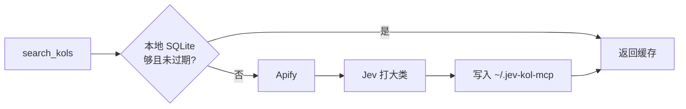

# jev-kol-mcp

[English](https://github.com/EdgeForgeLab/jev-kol-mcp/blob/main/README.md) · 中文

**查找 TikTok 和 YouTube 微网红，给账号打大类，并判断他们是否适合一次活动。**

基于 [Jev](https://typesafe.ai/blog/introducing-system-one-models-and-jev)（TypeSafe 的 System One 模型）的 MCP Server。搜索和存储留在本服务里。Jev 只回答类型化问题。邮件由调用方的模型来写。

[](https://nodejs.org)
[](LICENSE)
[](https://modelcontextprotocol.io)

Jev 不负责写搜索结果，也不写邮件。它只回答类型化问题：一道单选题决定达人的大类，再给出分数、概率和选项，判断这个达人是否适合某次活动。搜索和存储留在本服务里。邮件由调用方的模型来写。可选 skill 在 `skills/draft-outreach`，用来收紧草稿。

## 快速安装

把下面这段贴给 Cursor、Claude Desktop 或 Cline。只靠这段话就能装好：

```text
帮我安装 jev-kol-mcp。
1. 检查 Node.js 是否为 18 或更高版本，以及 npx 是否在 PATH 里。缺一则停止。执行 `command -v npx`，把得到的绝对路径写进 command。不要写裸的 npx。Cursor 自带的 Node 会去找 Cursor.app 里一个不存在的路径，服务器会立刻退出。
2. 向我要 APIFY_API_TOKEN 和 JEV_API_KEY。如果我还没有某一把，仍然写入配置，并把该值留成空字符串，告诉我哪个工具暂时不能用。不要编造密钥，也不要把密钥回显给我。
3. 判断客户端，把这个服务器合并进已有的 mcpServers。不要删掉其他服务器。文件不存在就创建。
   Cursor 当前项目：.cursor/mcp.json
   Cursor 所有项目：~/.cursor/mcp.json
   Claude Desktop（macOS）：~/Library/Application Support/Claude/claude_desktop_config.json
   Claude Desktop（Windows）：%APPDATA%\Claude\claude_desktop_config.json
   Cline：我指定的 mcpSettings 文件
4. 使用这条配置。env 里的值都是字符串。
   command：`command -v npx` 得到的绝对路径
   args：["-y", "jev-kol-mcp@latest"]
   env：APIFY_API_TOKEN、JEV_API_KEY、FETCH_LIMIT 为 "12"
   服务器键名：jev-kol
5. 不要提交这份配置。不要为了测试去调用 search_kols。告诉我改了哪个文件、两把密钥是否已填，并提醒我重新加载 MCP。加载后应看到 search_kols、score_fit、draft_email。
```

进程通过 stdio 提供 MCP。它不是 HTTP 服务，也不会打印交互提示。日志写在 stderr。stdout 只留给 MCP 协议。

## 可以做什么

| 工具 | 作用 | 需要 |
| --- | --- | --- |
| `search_kols` | 按平台、关键词和粉丝区间查找达人 | `APIFY_API_TOKEN` |
| `score_fit` | 用 0–100 分判断一个达人是否适合一次活动 | `JEV_API_KEY` |
| `draft_email` | 首封外联邮件，以及第 3 天的跟进 | `JEV_API_KEY` |

`draft_email` 只检查 Jev 密钥是否存在，然后填入本地英文模板。正文不是 Jev 写的。若要按用户自己的说法写信，把 `skills/draft-outreach` 复制到 `~/.cursor/skills/draft-outreach`。用户要求写邮件时，服务器的 instructions 会提一次这个路径。本服务不发信。跟进是同一线程的第二封草稿，只在首封已经发出、满 3 天且没有回复时使用。只跟一次，报价不变，然后停止。

## 一次搜索怎么走



相同平台、关键词和粉丝区间会复用 7 天。缓存里的账号不会再次抓取，也不会重新打标签。没有忽略缓存的参数。删掉 `~/.jev-kol-mcp/kols.sqlite` 才会重新搜索，下次搜索会新建一个空库。某一次 Jev 调用失败不会让搜索失败：该账号仍会入库，大类留空。

没有 `JEV_API_KEY` 时，`search_kols` 仍然返回达人，`primaryNiche` 留空，不会写成 `Other`。`score_fit` 和 `draft_email` 会返回配置说明。

粉丝上下限会传给爬虫。返回之前，本服务仍会丢掉区间外的结果。

| 平台 | Apify Actor | 区间过滤的是 |
| --- | --- | --- |
| TikTok | [`memo23/tiktok-user-search-scraper`](https://apify.com/memo23/tiktok-user-search-scraper) | 粉丝数 |
| YouTube | [`parsebird/youtube-channel-search-scraper`](https://apify.com/parsebird/youtube-channel-search-scraper) | 公开订阅数 |

`FETCH_LIMIT` 是向 Apify 请求多少个符合区间的账号，默认 **12**，这些都会入库。工具参数 `limit` 是本次返回几条，默认 **5**，最大 **20**。

YouTube 的 `countryHint` 保持 Actor 默认值。它影响排序，不会只保留那个国家的频道。

## 返回什么

每个入库的达人有这些字段。头像不存储。

| 字段 | 说明 |
| --- | --- |
| `handle` | 账号名，带 `@` |
| `displayName` | 主页上显示的名字 |
| `followers` | TikTok 粉丝数，或 YouTube 订阅数 |
| `bio` | 公开简介 |
| `contactEmail` | 用正则从公开简介里提取的邮箱。没有公开邮箱时为 `null` |
| `emailType` | 找到邮箱时为 `personal` 或 `agency`，否则为 `null` |
| `profileUrl` | 主页地址 |
| `verified` | Actor 是否标明已认证。没说明时为 `null` |
| `videoCount` | 公开视频数 |
| `totalLikes` | TikTok 获赞数。YouTube 上始终为 `null` |
| `totalViews` | YouTube 播放量。TikTok 上始终为 `null` |
| `location` | TikTok 上是 Actor 报出的地区代码，YouTube 上是频道国家。TikTok 经常为空 |
| `bioLinks` | 简介里的链接。当前 TikTok Actor 为空。YouTube 只有 URL，没有锚文字 |
| `primaryNiche` | 下表中的一个标签。没调用 Jev 或调用失败时为空 |

### 大类标签

Jev 根据显示名和简介选一个主类。这个标签不会传给 `score_fit`。活动契合度是另一次 Jev 调用。

| 标签 | 覆盖的内容 |
| --- | --- |
| `Beauty_Skincare` | 护肤、彩妆、医美、假发 |
| `Men_Grooming` | 男士护理、胡须、香水、造型 |
| `Fashion_Apparel` | 日常服装、鞋、包、穿搭、配饰 |
| `Luxury_Jewelry` | 轻奢、珠宝、腕表 |
| `Tech_Gadgets` | 消费电子、智能家居、无人机、桌面设备 |
| `Software_SaaS_AI` | AI 工具、效率软件、应用、Web3 或加密产品 |
| `Gaming_Esports` | 主机或手游评测、直播、电竞装备 |
| `Fitness_Wellness` | 健身、瑜伽、补剂、减脂 |
| `Outdoor_Adventure` | 露营、徒步、钓鱼、滑雪、极限运动 |
| `Home_Living` | 家居装饰、厨房、家电、生活记录 |
| `Food_Cooking` | 美食、探店、烘焙、快手菜、饮品 |
| `Parenting_Kids` | 育儿、母婴、儿童玩具 |
| `Pet_Care` | 猫狗用品、宠物内容、异宠 |
| `Automotive_Vehicles` | 汽车、电动车、摩托、骑行 |
| `Finance_Investing` | 个人理财、股票、加密投资、房产 |
| `Education_Career` | 语言学习、职业、留学、考试 |
| `Arts_DIY_Crafts` | 手作、绘画、3D 打印、设计 |
| `Entertainment_Humor` | 喜剧、街访、影视动漫、音乐舞蹈 |
| `Other` | 简介太短，或看不出一个主类 |

## 活动契合度

`score_fit` 把账号、简介和活动描述发到 `https://api.typesafe.ai/v1/systemone`。它看不到粉丝数、地区，也看不到大类标签。模型默认是 `jev-latest`（可用 `JEV_MODEL` 修改）。

| 字段 | 含义 |
| --- | --- |
| `score` | 0–100，由 Jev 的 0–3 分换算 |
| `dimensions.fit` | 0 不相关 · 1 勉强 · 2 部分匹配 · 3 高度匹配 |
| `dimensions.niche` | 简介和产品属于同一类的概率 |
| `dimensions.tone` | `review` · `lifestyle` · `tutorial` · `sincere` · `unknown` |
| `dimensions.priceBand` | 推断的客单价档，不是达人报价 |
| `suitablePriceRange` | 该档对应的美元区间，无法判断时为 `null` |
| `dimensions.outreach` | 现在值得发首封邮件的概率 |
| `dimensions.mismatch` | `none` · `niche` · `tone` · `price` · `evidence` |

调性只看简介。客单价档位是 `food` 15–80、`everyday` 20–100、`beauty` 25–120、`fitness` 30–150、`home` 30–200、`tech` 80–400、`luxury` 200–800。`unknown` 表示简介不够。

高度匹配要求垂类、调性和客单价同时说得通。有一项明显不合，就不能给到高度匹配。

## 使用

需要 Node.js 18 或更高版本。把服务器加进 MCP 客户端即可。Cursor 读项目里的 `.cursor/mcp.json`，若要所有项目都能用，则写到 `~/.cursor/mcp.json`。第一次启动时 `npx` 会下载这个包，不用克隆本仓库。`command` 必须是 `command -v npx` 得到的绝对路径，不能写裸的 `npx`。

```json
{
  "mcpServers": {
    "jev-kol": {
      "command": "/absolute/path/from/command -v npx",
      "args": ["-y", "jev-kol-mcp@latest"],
      "env": {
        "APIFY_API_TOKEN": "your_apify_api_token",
        "JEV_API_KEY": "your_jev_api_key",
        "FETCH_LIMIT": "12"
      }
    }
  }
}
```

`env` 里的值都是字符串，包括 `FETCH_LIMIT`。保存后重新加载 MCP。`jev-kol` 只是示例里的键名，Cursor 显示的是你自己写的那个键。

## 从源码安装

改服务器本身时用这一节。平常使用上面的 `npx` 配置就够了。

```bash
npm install
cp .env.example .env
npm run build
```

`npm run watch` 会在保存时编译到 `dist/`。`npm start` 运行本地构建。客户端改为指向这个文件，而不是 `npx`：

```json
{
  "mcpServers": {
    "jev-kol": {
      "command": "node",
      "args": ["/absolute/path/to/jev-kol-mcp/dist/index.js"],
      "env": {
        "APIFY_API_TOKEN": "your_apify_api_token",
        "JEV_API_KEY": "your_jev_api_key",
        "FETCH_LIMIT": "12"
      }
    }
  }
}
```

缺少密钥时返回配置说明，进程不会退出。`your_apify_api_token_here` 这类占位符视为未配置。

| 变量 | 是否必需 | 默认 |
| --- | --- | --- |
| `APIFY_API_TOKEN` | 搜索需要 | — |
| `JEV_API_KEY` | 大类、契合度打分和邮件草稿需要 | — |
| `JEV_MODEL` | 否 | `jev-latest` |
| `FETCH_LIMIT` | 否 | `12` |

- Apify Token：<https://console.apify.com/account/integrations>
- Jev 密钥：向 TypeSafe 申请，请求头为 `Authorization: Bearer`

客户端注入的环境变量优先于 `.env`。

SQLite 文件在 `~/.jev-kol-mcp/kols.sqlite`。删掉它之后，下次搜索会新建一个空库。清掉 npx 缓存不会删掉这个文件。

真实密钥写在 `env` 里，不要提交。想在对话里用提示词完成安装，用 `skills/jev-kol-mcp-installer`。

## 示例提示词

`search_kols` 只接受平台、关键词和粉丝区间，不接受国家，也不接受大类标签。`score_fit` 需要达人简介和活动说明。邮件里的报价必须由你提供。

```text
用 jev-kol 的 search_kols 在 TikTok 上搜索美妆达人，粉丝 1 万到 20 万，返回 5 条。列出账号、粉丝数、地区、大类标签和简介。不要打分。
```

```text
用 score_fit 评估 @maya.glow。简介：干净妆容和负担得起的日常护肤。活动：一款强调真实日常使用的平价护肤品。不要写邮件。
```

```text
在 YouTube 上搜索咖啡意式浓缩频道，订阅 5 千到 20 万，返回 3 条，带上账号、订阅数和简介。按一台手动意式咖啡机的活动给每条简介打分。只为最合适的一位起草外联邮件。写信前先问我报价。
```

## 许可证

[MIT](LICENSE)
