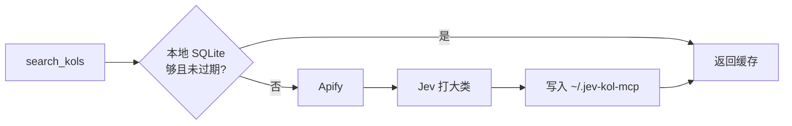

# jev-kol-mcp

[English](README.md) · 中文

基于 [Jev](https://typesafe.ai/blog/introducing-system-one-models-and-jev)（TypeSafe 的 System One 模型）的 MCP Server。它查找 TikTok 和 YouTube 微网红，给账号打大类标签，并用类型化判定给活动契合度打分。

[](https://nodejs.org)
[](LICENSE)
[](https://modelcontextprotocol.io)

Jev 不负责写搜索结果，也不写邮件。它只回答类型化问题：一道单选题决定达人的大类，再给出分数、概率和选项，判断这个达人是否适合某次活动。搜索和存储留在本服务里。邮件草稿是本地模板。

## 可以做什么

| 工具 | 作用 | 需要 |
| --- | --- | --- |
| `search_kols` | 按平台、关键词和粉丝区间查找达人 | `APIFY_API_TOKEN` |
| `score_fit` | 用 0–100 分判断一个达人是否适合一次活动 | `JEV_API_KEY` |
| `draft_email` | 首封外联邮件，以及第 3 天的跟进 | `JEV_API_KEY` |

`draft_email` 只检查 Jev 密钥是否存在，然后填入本地英文模板。正文不是 Jev 写的。

## 一次搜索怎么走



相同平台、关键词和粉丝区间会复用 7 天。缓存里的账号不会再次抓取，也不会重新打标签。某一次 Jev 调用失败不会让搜索失败：该账号仍会入库，大类留空。

粉丝上下限会传给爬虫。返回之前，本服务仍会丢掉区间外的结果。

| 平台 | Apify Actor | 区间过滤的是 |
| --- | --- | --- |
| TikTok | [`memo23/tiktok-user-search-scraper`](https://apify.com/memo23/tiktok-user-search-scraper) | 粉丝数 |
| YouTube | [`parsebird/youtube-channel-search-scraper`](https://apify.com/parsebird/youtube-channel-search-scraper) | 公开订阅数 |

`FETCH_LIMIT` 是向 Apify 请求多少个符合区间的账号，默认 **12**，这些都会入库。工具参数 `limit` 是本次返回几条，默认 **5**，最大 **20**。

YouTube 的 `countryHint` 保持 Actor 默认值。它影响排序，不会只保留那个国家的频道。

## 返回什么

每个入库的达人可以包含：

`handle` · `displayName` · `followers` · `bio` · `contactEmail` · `emailType` · `profileUrl` · `verified` · `videoCount` · `totalLikes` · `totalViews` · `location` · `bioLinks` · `primaryNiche`

邮箱用正则从公开简介里提取。没有公开邮箱时为 `null`。当前 TikTok Actor 不返回简介链接，所以那边的 `bioLinks` 为空。YouTube 链接只有 URL，没有锚文字。头像不存储。

`location` 在 TikTok 上是 Actor 报出的地区代码，在 YouTube 上是频道国家。TikTok 经常为空。

`totalLikes` 只有 TikTok 有。`totalViews` 只有 YouTube 有。

### 大类标签

Jev 根据显示名和简介选一个主类。简介太短，或看不出一个主类时，标为 `Other`。

`Beauty_Skincare` · `Men_Grooming` · `Fashion_Apparel` · `Luxury_Jewelry` · `Tech_Gadgets` · `Software_SaaS_AI` · `Gaming_Esports` · `Fitness_Wellness` · `Outdoor_Adventure` · `Home_Living` · `Food_Cooking` · `Parenting_Kids` · `Pet_Care` · `Automotive_Vehicles` · `Finance_Investing` · `Education_Career` · `Arts_DIY_Crafts` · `Entertainment_Humor` · `Other`

这个标签不会传给 `score_fit`。活动契合度是另一次 Jev 调用。

## 活动契合度

`score_fit` 把账号、简介和活动描述发到 `https://api.typesafe.ai/v1/systemone`。它看不到粉丝数、地区，也看不到大类标签。模型默认是 `jev-latest`（可用 `JEV_MODEL` 修改）。

| 字段 | 含义 |
| --- | --- |
| `score` | 0–100，由 Jev 的 0–3 分换算 |
| `dimensions.fit` | 0 不相关 · 1 勉强 · 2 部分匹配 · 3 高度匹配 |
| `dimensions.niche` | 简介和产品属于同一类的概率 |
| `dimensions.tone` | `review` · `lifestyle` · `tutorial` · `sincere` · `unknown` |
| `dimensions.priceBand` | 推断的客单价档，不是达人报价 |
| `suitablePriceRange` | 该档对应的美元区间，无法判断时为 `null` |
| `dimensions.outreach` | 现在值得发首封邮件的概率 |
| `dimensions.mismatch` | `none` · `niche` · `tone` · `price` · `evidence` |

调性只看简介。客单价档位是 `food` 15–80、`everyday` 20–100、`beauty` 25–120、`fitness` 30–150、`home` 30–200、`tech` 80–400、`luxury` 200–800。`unknown` 表示简介不够。

高度匹配要求垂类、调性和客单价同时说得通。有一项明显不合，就不能给到高度匹配。

## 安装

```bash
npm install
cp .env.example .env
npm run build
```

需要 Node.js 18 或更高版本。`npm run watch` 会在保存时编译到 `dist/`。`npm start` 通过 stdio 提供 MCP。它不是 HTTP 服务，也不会打印交互提示。

日志写在 stderr。stdout 只留给 MCP 协议。

缺少密钥时返回配置说明，进程不会退出。`your_apify_api_token_here` 这类占位符视为未配置。

| 变量 | 是否必需 | 默认 |
| --- | --- | --- |
| `APIFY_API_TOKEN` | 搜索需要 | — |
| `JEV_API_KEY` | 大类、契合度打分和邮件草稿需要 | — |
| `JEV_MODEL` | 否 | `jev-latest` |
| `FETCH_LIMIT` | 否 | `12` |

- Apify Token：<https://console.apify.com/account/integrations>
- Jev 密钥：向 TypeSafe 申请，请求头为 `Authorization: Bearer`

客户端注入的环境变量优先于 `.env`。

SQLite 文件在 `~/.jev-kol-mcp/kols.sqlite`。删掉它之后，下次搜索会新建一个空库。清掉 npx 缓存不会删掉这个文件。

## Cursor

先构建，确保 `dist/index.js` 存在。让客户端指向这个文件。真实密钥写在 `env` 里，不要提交。

```json
{
  "mcpServers": {
    "jev-kol": {
      "command": "node",
      "args": ["/absolute/path/to/jev-kol-mcp/dist/index.js"],
      "env": {
        "APIFY_API_TOKEN": "your_apify_api_token",
        "JEV_API_KEY": "your_jev_api_key",
        "FETCH_LIMIT": "12"
      }
    }
  }
}
```

`env` 里的值都是字符串，包括 `FETCH_LIMIT`。改了 `dist/` 或这份配置后，重新加载 MCP。`jev-kol` 只是示例里的键名，Cursor 显示的是你自己写的那个键。

可以这样试：

```text
用 jev-kol 的 search_kols 在 TikTok 上搜索美妆达人，粉丝 1 万到 20 万，返回 5 条。列出账号、粉丝数、地区、大类标签和简介。不要打分。
```

## 许可证

[MIT](LICENSE)
